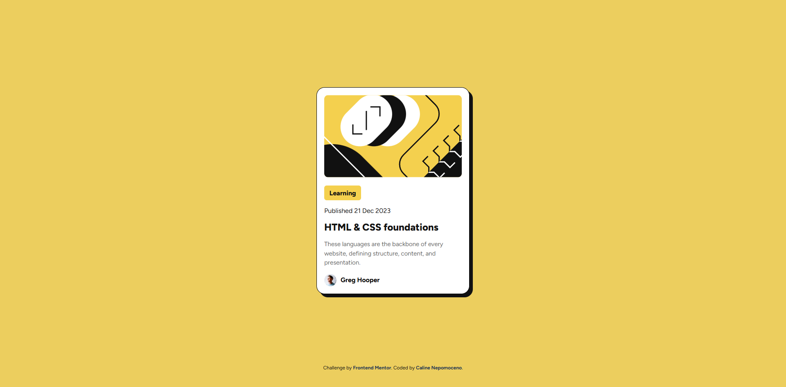

# 🃏 CardBlog — Blog Preview Card


Resolução do desafio **Blog preview card** do [Frontend Mentor](https://www.frontendmentor.io/). O objetivo foi construir a interface de um card de artigo focando na fidelidade visual e organização do código.

🔗 **[🚀 Clique aqui para ver o projeto online](https://acali10.github.io/CardBlog/)**

---

## 📷 Demonstração



---

## 🛠️ Tecnologias e Conceitos Aplicados

- **HTML5 Semântico:** Uso das tags `<main>` para o conteúdo principal e `<footer>` para os créditos finais.
- **Flexbox:** Centralização do card na tela com `min-height: 100vh` no `body` e alinhamento interno dos elementos (como a foto e o nome do autor em `.perfil`).
- **Variáveis CSS (`:root`):** Organização e reuso das cores do projeto (`--amarelo`, `--amareloforte`, `--cinzaescuro`, `--cinzafraco`).
- **CSS Nesting:** Utilização do aninhamento nativo do CSS para organizar regras de elementos filhos dentro de seletores principais (ex: `.card`, `.textos` e `.perfil`).
- **Tipografia Externa:** Importação da fonte **Figtree** diretamente do Google Fonts.
- **Estilização e Sombras:** Aplicação de bordas arredondadas (`border-radius`) e efeito de sombra sólida (`box-shadow`).

---

## 💻 Como rodar o projeto localmente

1. Clone o repositório:
   ```bash
   git clone [https://github.com/acali10/CardBlog.git](https://github.com/acali10/CardBlog.git)
Acesse a pasta do projeto:

Bash
cd CardBlog
Abra o arquivo index.html em seu navegador.

👤 Autora
Desenvolvido por Caline Nepomoceno:

GitHub: @acali10

Frontend Mentor: @acali10